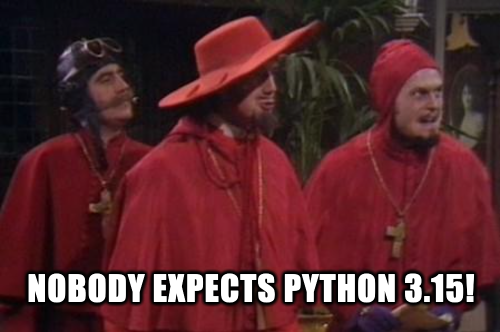
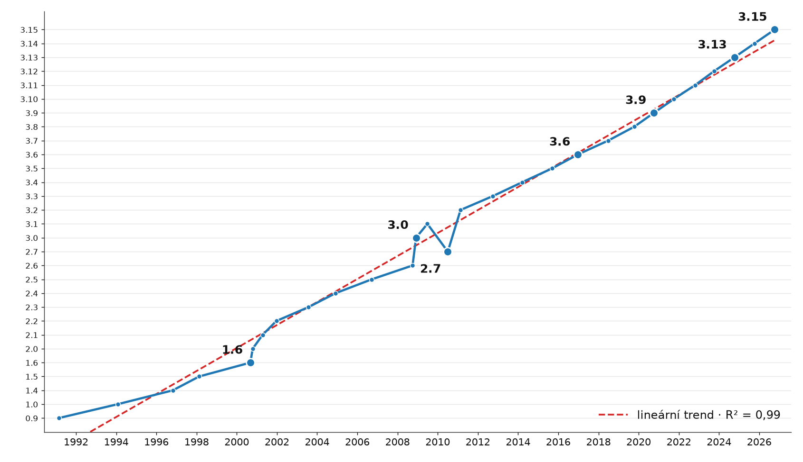

# Nobody expects the Python 3.15 release

> 35 let vývoje · 0.9 (1991) -> 3.15 (~9. 10. 2026)



> [!NOTE]
> "Python 3.26 will be released in 2026 instead of Python 3.15"
(PEP 2026, zamítnuto)

\
<br/>

```
Our chief weapon is backwards compatibility…
backwards compatibility and performance…
performance and free-threading…
```


\
\
\
\
<br/>


