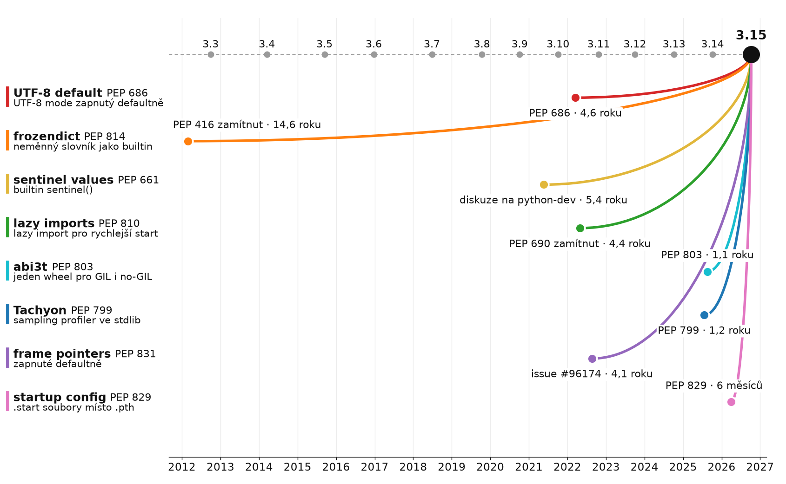

# Co je ve 3.15 nového

> release **9. 10. 2026** (původně 1. 10.)

## Výběr důležitých změn

| | PEP | komentář |
|---|---:|---|
| **frozendict** | 814 | builtin, hashovatelný |
| **sentinel** | 661 | `MISSING = sentinel("MISSING")` |
| **frame pointers** | 831  | `perf` a eBPF konečně vidí Python |
| **lazy imports** | 810  | `lazy import numpy` |
| **UTF-8 default** | 686  | `open()` bez `encoding=` je UTF-8 i na Windows |
| **abi3t** | 803 |  jeden wheel pro GIL i free-threaded |
| **profiling / Tachyon** | 799  | sampling profiler ve stdlib |
