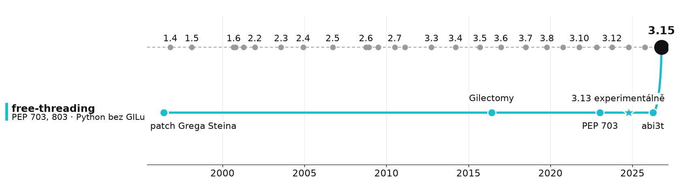
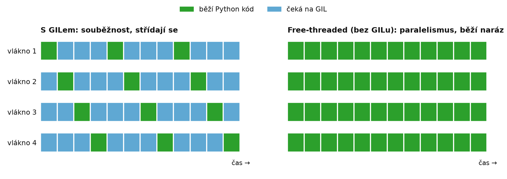

# Kill GIL, again

> free-threading (PEP 703, PEP 779) + stable ABI abi3t (PEP 803)\
> 1996 první patch a stable ABI po **30 letech**



## Co je GIL

- **jeden zámek** na celý interpret
- jednoduchý refcounting, rychlé single-thread, bezpečné C extensions

**4 CPU-bound vlákna**



### Co přináší free-threading:
- významné zrychlení u multithread CPU-bound kódu v Pythonu
- žádná změna u multithread I/O-bound (síť, disk) kódu
- single-thread výkon půjde dolu o 5 % - 10 %


## Proč je 3.15 důležitá: abi3t

- 3.13 experimentální · 3.14 oficiálně podporované · **3.15: stabilní ABI**
- dnes: `verze x platforma x {GIL, no-GIL}`

```
numpy 2.5.3 -> 59 wheelů   (cp312 cp313 cp314 cp314t cp315 cp315t x platformy)
pydantic    -> 112 wheelů
scipy       -> ~60 wheelů
```

- **abi3t**: jeden `cp315-abi3.abi3t` wheel pro GIL i free-threaded, 3.15+
- háček: setuptools, meson-python, scikit-build-core, maturin to **zatím neumí**
