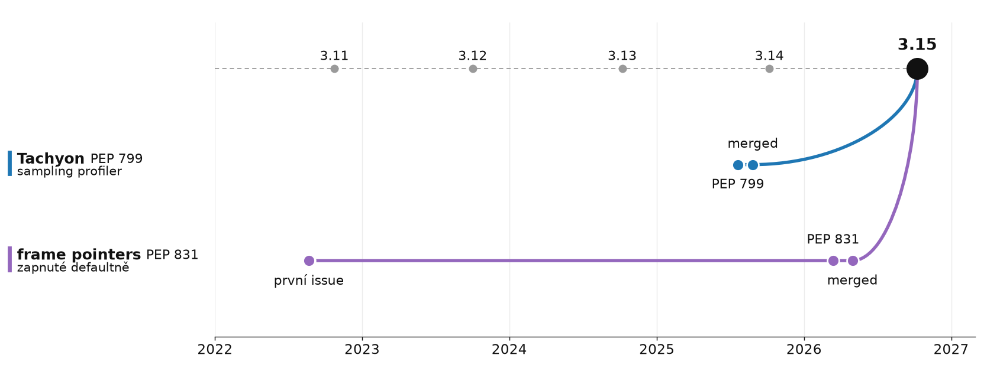

# Co kód skutečně dělá?

> Profiling (PEP 799) + frame pointers (PEP 831)




## `profiling` package

- `profiling.tracing` = starý cProfile · `profile` deprecated, pryč ve 3.17
- `profiling.sampling` = **Tachyon** · čte paměť procesu **zvenku**, „virtually zero overhead“

```bash
python -m profiling.sampling run app.py
python -m profiling.sampling attach 12345            # běžící proces
python -m profiling.sampling attach --live 12345     # top pro Python
```

- režimy `wall` · `cpu` · `gil` · `exception`
- výstupy: flamegraph, gecko (Firefox Profiler), heatmap, pstats…

## Frame pointers všude

- `-fno-omit-frame-pointer` defaultně, dědí i C extensions
- cena: **0,2–2,3 %** (pyperformance)
- zisk: stack walking **~210x rychlejší** než DWARF · `perf`, eBPF, stripped binárky
