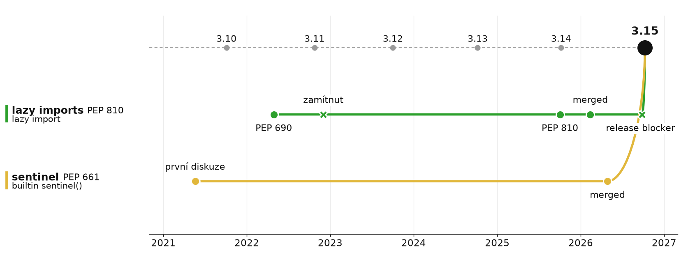

# Quality of life

> lazy imports (PEP 810) + sentinel (PEP 661)\
> řeší problémy, které už všichni dávno vyřešili sami



## Lazy imports: evoluce

**1. import ve funkci** · funguje od Pythonu 1.0

```python
def export_report():
    import pandas as pd
    ...
```

**2. dekorátor** · „elegantnější“

```python
from importlib import import_module
from functools import wraps


def requires(module_name):
    module = None

    def decorator(func):
        @wraps(func)
        def wrapper(*args, **kwargs):
            nonlocal module
            if module is None:
                module = import_module(module_name)
            return func(module, *args, **kwargs)
        return wrapper
    return decorator


@requires("pandas")
def load_csv(pd, filename):
    return pd.read_csv(filename)
```

**3. proxy modul** · scientific Python (`lazy_loader`)

```python
from importlib import import_module


class LazyModule:
    def __init__(self, name):
        self.name = name
        self.module = None

    def __getattr__(self, attr):
        if self.module is None:
            self.module = import_module(self.name)
        return getattr(self.module, attr)


numpy = LazyModule("numpy")
numpy.array([1, 2, 3])   # numpy se importuje až zde
```

**4. Python 3.15** · nová syntaxe

```python
lazy import numpy
lazy from json import dumps, loads
```

- jen na úrovni modulu · ne ve funkci, třídě, `try` · ne `import *`
- `-X lazy_imports=all` · `sys.set_lazy_imports_filter(...)`
- PEP slibuje **50–70 %** rychlejší start CLI

## Háček

```python
lazy import nunpy          # žádná chyba při startu

def handler():
    nunpy.array([1, 2, 3]) # ImportError až tady, v produkci, ve 3 ráno
```

- chyby se přesouvají **ze startu do runtime**
- dobré pro velké, dobře testované frameworky · pro malý skript spíš ne
- důvod odložení vydání 3.15, `lazy import a.b as c` importoval špatnou věc (gh-157757, rc3)


## Sentinel

Problém: `None` je platná hodnota.

```python
_MISSING = object()

def get(d, key, default=_MISSING): ...
```

```
>>> help(get)
get(d, key, default=<object object at 0x7f3a2c1b4e70>)
```

- ošklivý `repr` v REPLu, `help()`, tracebacku
- nejde rozumně anotovat · po pickle je to jiný objekt a `is` selže

**3.15:** builtin `sentinel`

```python
MISSING = sentinel("MISSING")


def get(d: dict, key: str, default: object | MISSING = MISSING):
    try:
        return d[key]
    except KeyError:
        if default is MISSING:
            raise
        return default        # get(d, "x", None) legitimně vrátí None
```

```
>>> help(get)
get(d, key, default=MISSING)
```

- `repr` je `MISSING` · funguje v anotacích (`int | MISSING`) · `copy` vrací totéž
- ve stdlib už to dávno je: `dataclasses.MISSING`, `inspect.Parameter.empty`…
