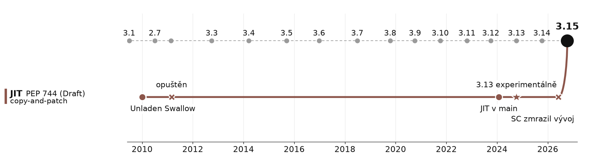

# JIT

> JIT (PEP 744, pořád Draft) + plán do budoucna (PEP 836)\
> copy-and-patch · ve 3.13, 3.14 i 3.15 **experimentální** · default **vypnutý**

## Kolik to stojí: řádky kódu

- PEP 744 slibuje ~900 ř. Pythonu + ~500 ř. C
- realita 3.15: **~14 000 řádků** · 10× víc · a to je dolní mez
- počítáno z gitu: bez generovaných souborů, testů, CI, dokumentace

## Co to přináší

| platforma | zrychlení (geomean) |
|---|---:|
| x86-64 Linux | **7–8 %** |
| AArch64 macOS | 11–12 % |
| Windows (PEP 836) | ~5 % |
| jednotlivé benchmarky | −15 % až +100 % |

- zapnutí: `PYTHON_JIT=1`
- paměť: „slightly higher“, oficiální číslo raději nikdo neuvádí
- **06/2026: Steering Council zmrazil vývoj** → do 6 měsíců Standards Track PEP, jinak pryč z main
- odpověď: **PEP 836 „JIT Go Brrr“** · cíl ≥ 5 % ve 3.16, ≥ 20 % s free-threadingem ve 3.17

## Proč jsem skeptický

- **metaprogramování** · dynamické typy, `__getattr__`, monkeypatching -> JIT neustále deoptimalizuje
- co má být rychlé, už je v **C / C++ / Rustu** (numpy, pydantic-core, polars, orjson)
- alternativy už existují: **Cython**, **PyPy**, **mypyc**, **Numba**
- historie: **Unladen Swallow** (Google, 2010) · přijatý PEP 3146 · opuštěn 2011
