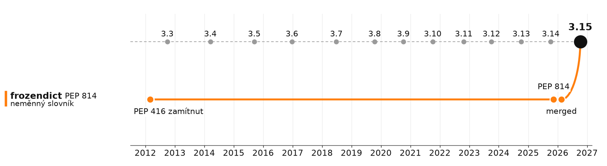

# Frozendict

> PEP 416 zamítnut 2012 · PEP 814 přijat 2026 · **14 let** na neměnný slovník



```python
a = frozendict(x=1, y=2)
b = frozendict(y=2, x=1)

a == b, hash(a) == hash(b)   # (True, True)
{a: "jde jako klíč"}

a["z"] = 3                   # TypeError
```

- builtin · **není** podtřída `dict` (požadavek Steering Councilu)
- hashovatelný, pokud jsou hashovatelné hodnoty
- mezitím od 3.3: `types.MappingProxyType` · „neměnný pohled“

## Jednoduché? Skoro.

- `frozendict.__init__` odstraněn · šlo přes něj frozendict **zmutovat**
- data race ve free-threaded buildu (gh-151722)
- podpora v `copy`, `pickle`, `json`, `marshal`, `pprint`, `plistlib`…
